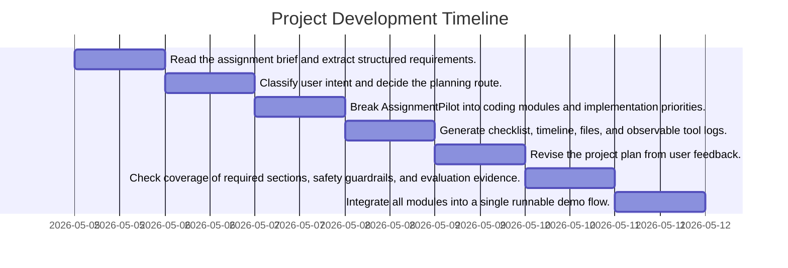

# 📅 CA6123 AssignmentPilot Project Timeline

## 📊 Visual Progress (Mermaid Gantt)

## 📋 Detailed Schedule
| Phase | Core Task Description |
|---|---|
| **** | Read the assignment brief and extract structured requirements. |
| **** | Classify user intent and decide the planning route. |
| **** | Break AssignmentPilot into coding modules and implementation priorities. |
| **** | Generate checklist, timeline, files, and observable tool logs. |
| **** | Revise the project plan from user feedback. |
| **** | Check coverage of required sections, safety guardrails, and evaluation evidence. |
| **** | Integrate all modules into a single runnable demo flow. |
